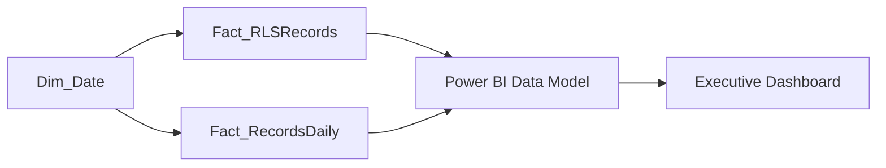

# BA-003 | Executive Records Performance Dashboard (Power BI)

> Business Analytics Portfolio Series

Designed and developed an interactive Power BI reporting solution that transformed operational data into executive dashboards supporting leadership decision-making, operational visibility, KPI reporting, and performance monitoring.

---

📊 Project Snapshot

---

# Business Context

Following the successful implementation of the Enterprise Records Management & Compliance System (BA-002), executive leadership required a method of transforming operational records into meaningful performance metrics.

While the records management system successfully tracked document accountability and processing activities, leadership still relied on manually compiling operational reports from Excel workbooks to understand overall facility performance. This process consumed valuable administrative time, limited visibility into emerging operational issues, and made historical trend analysis difficult.

To address these challenges, I designed and developed an Executive Operations Dashboard using Microsoft Power BI. The dashboard served as the executive reporting layer for the records management system, converting detailed operational data into interactive visualizations and key performance indicators (KPIs) that leadership could use to monitor performance and support data-driven decision-making.

The solution provided a centralized view of operational health by measuring records completion, processing volume, missing documentation, monthly performance trends, and overall audit readiness across more than 20,000 detainee release records processed between July 2025 and June 2026.

## Why This Solution Was Needed

Executive leadership needed the ability to:

- Monitor records processing performance without manually compiling reports.
- Measure document completion rates across the reporting period.
- Identify operational bottlenecks and outstanding documentation.
- Track historical processing trends over time.
- Evaluate audit readiness using objective performance metrics.
- Make operational decisions using a centralized reporting platform.
  
---

# Executive Summary

Following the implementation of the Enterprise Records Management & Compliance System (BA-002), executive leadership required a centralized reporting platform capable of monitoring operational performance, document accountability, and records processing efficiency.

I independently designed and developed an Executive Operations Dashboard using Microsoft Power BI to transform over 20,000 detainee record transactions into meaningful executive-level insights. The dashboard consolidated operational data from the records management database into an interactive reporting platform that provided leadership with real-time visibility into record completion, processing trends, missing documentation, and overall operational performance.

By replacing manually compiled daily reports with automated executive dashboards, the solution significantly reduced reporting effort while enabling leadership to quickly identify operational bottlenecks, monitor compliance performance, and make informed decisions based on consistent, data-driven metrics.

---

# Operational Environment

The Executive Records Performance Dashboard supported executive oversight of records management operations at the Alligator Alcatraz detention facility.

The dashboard analyzed operational data generated by the Enterprise Records Management & Compliance System between **July 2025 and June 2026**, encompassing more than **20,000 detainee release records**. The reporting platform transformed detailed record-level data into executive key performance indicators (KPIs), historical trend analysis, and operational metrics designed to support leadership decision-making.

Executive reporting focused on monitoring:

- Total detainee releases processed
- Completed records
- Outstanding or missing documentation
- Overall records completion rate
- Monthly operational performance
- Average monthly processing volume
- Historical processing trends
- Audit readiness and records accountability

The dashboard provided leadership with a centralized view of operational performance, replacing manual spreadsheet-based reporting with interactive, real-time business intelligence.

---

# Business Problem

Although multiple operational tracking systems had been successfully implemented throughout the facility, executive leadership still lacked a centralized reporting platform capable of providing real-time operational visibility.

Operational metrics were compiled manually each morning by reviewing multiple Excel databases, validating information across departments, and producing leadership reports through repetitive manual effort. As operational complexity increased, this process became increasingly time-consuming while limiting leadership's ability to quickly identify emerging trends or operational risks.

The organization required a centralized business intelligence solution capable of consolidating operational data into a single executive reporting platform that could provide:

- Real-time operational KPIs
- Daily executive reporting
- Historical trend analysis
- Compliance monitoring
- Workload visibility
- Performance measurement
- Executive decision support

Without a centralized dashboard, operational reporting remained reactive rather than proactive, making it difficult for leadership to identify issues before they affected operational performance.

---

# Reporting Requirements

The Executive Records Performance Dashboard was designed to replace manually compiled daily reports with an interactive business intelligence solution that provided executive leadership with immediate visibility into operational performance.

The reporting platform needed to satisfy several business requirements:

- Provide a single source of truth for executive operational reporting.
- Display real-time records processing performance.
- Measure document completion rates across the reporting period.
- Monitor outstanding or missing documentation.
- Track monthly operational workload and release volume.
- Identify trends affecting operational efficiency.
- Support audit readiness through measurable performance indicators.
- Reduce manual report preparation by automating KPI calculations.
- Present information in a format easily understood by executive leadership.

The dashboard emphasized simplicity and usability, allowing leadership to evaluate operational performance within minutes rather than relying on manually compiled spreadsheet reports.

---

# KPI Framework

The dashboard was designed around executive-level Key Performance Indicators (KPIs) that measured both operational productivity and records management performance.

| KPI | Business Purpose |
|------|------------------|
| Total Releases | Measures total detainee releases processed during the reporting period. |
| Completed Records | Tracks records that have been fully reviewed and finalized. |
| Hold / Missing Documents | Identifies records requiring additional documentation or corrective action. |
| Completion Rate | Measures the percentage of completed records relative to total releases. |
| Average Monthly Releases | Provides leadership with average operational workload across the reporting period. |
| Monthly Operational Performance | Visualizes processing volume and completion trends over time. |
| Monthly Missing Documentation | Highlights periods requiring additional operational focus or staffing support. |

These KPIs allowed executive leadership to monitor overall operational health while identifying performance trends that could impact compliance, audit readiness, and resource planning.

## Executive Questions Answered

The dashboard was designed to help leadership answer critical operational questions, including:

- How many detainee releases have been processed?
- What percentage of records have been completed?
- How many records are currently missing required documentation?
- Which months experienced the highest operational workload?
- Are document completion rates improving over time?
- Which reporting periods require additional operational attention?
- Is the organization maintaining audit readiness?

---

# Data Sources

Executive Records Performance Dashboard consumed structured operational data generated by the Enterprise Records Management & Compliance System.

Primary data model:

• Fact_RLSRecords
    Detailed detainee record-level operational data.

• Fact_RecordsDaily
    Daily operational summary metrics used for KPI reporting.

• Dim_Date
    Calendar dimension supporting trend analysis and time intelligence.

The underlying Excel database contained more than 20,000 detainee record transactions processed between July 2025 and June 2026. These datasets were modeled within Power BI to provide interactive executive reporting and historical performance analysis.

---

# Technologies Used

- Microsoft Power BI
- Power Query
- DAX
- Microsoft Excel
- Pivot Tables
- Pivot Charts
- Data Modeling
- Excel Data Validation
- Advanced Excel Formulas

---

# Data Model

The Executive Records Performance Dashboard was built using a simplified dimensional data model designed for efficient reporting, scalable analytics, and straightforward maintenance.

The model consisted of three primary tables:

| Table | Purpose |
|--------|---------|
| **Fact_RLSRecords** | Primary fact table containing detailed detainee release records and document completion status. |
| **Fact_RecordsDaily** | Daily operational summary table used for KPI calculations and historical trend reporting. |
| **Dim_Date** | Calendar dimension supporting time intelligence, monthly trend analysis, and reporting period calculations. |

The dimensional model separated detailed operational data from summarized reporting metrics, allowing Power BI to efficiently calculate KPIs while supporting interactive filtering across the reporting period.

---

# Power BI Architecture

The reporting platform followed a structured Business Intelligence architecture designed to transform operational records into executive reporting.

Operational data originated within the Enterprise Records Management & Compliance System before being imported into Power BI for modeling, KPI calculations, and visualization.

The architecture consisted of four primary layers:

1. Operational Records Database
2. Power BI Data Model
3. DAX Business Logic
4. Executive Dashboard

This separation allowed business rules and calculations to remain centralized while providing leadership with a consistent reporting experience.

---

# DAX Measures

...

---

# Dashboard Design

...

---

# Executive Reporting

...

---

# Business Value

...

---

# Screenshots

...

---

# Lessons Learned

...

---

# Future Enhancements

...

---
